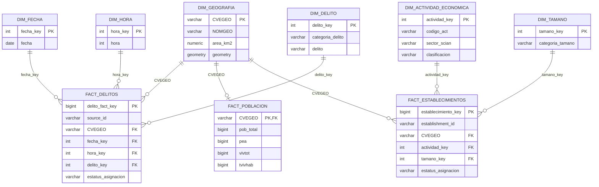

# Modelo dimensional del Data Warehouse

```mermaid
erDiagram
    DIM_GEOGRAFIA ||--o{ FACT_DELITOS : CVEGEO
    DIM_GEOGRAFIA ||--o| FACT_POBLACION : CVEGEO
    DIM_GEOGRAFIA ||--o{ FACT_ESTABLECIMIENTOS : CVEGEO
    DIM_FECHA ||--o{ FACT_DELITOS : fecha_key
    DIM_HORA ||--o{ FACT_DELITOS : hora_key
    DIM_DELITO ||--o{ FACT_DELITOS : delito_key
    DIM_ACTIVIDAD_ECONOMICA ||--o{ FACT_ESTABLECIMIENTOS : actividad_key
    DIM_TAMANO ||--o{ FACT_ESTABLECIMIENTOS : tamano_key

    DIM_GEOGRAFIA {
        varchar CVEGEO PK
        varchar NOMGEO
        numeric area_km2
        geometry geometry
    }
    DIM_FECHA {
        int fecha_key PK
        date fecha
    }
    DIM_HORA {
        int hora_key PK
        int hora
    }
    DIM_DELITO {
        int delito_key PK
        varchar categoria_delito
        varchar delito
    }
    DIM_ACTIVIDAD_ECONOMICA {
        int actividad_key PK
        varchar codigo_act
        varchar sector_scian
        varchar clasificacion
    }
    DIM_TAMANO {
        int tamano_key PK
        varchar categoria_tamano
    }
    FACT_DELITOS {
        bigint delito_fact_key PK
        varchar source_id
        varchar CVEGEO FK
        int fecha_key FK
        int hora_key FK
        int delito_key FK
        varchar estatus_asignacion
    }
    FACT_POBLACION {
        varchar CVEGEO PK,FK
        bigint pob_total
        bigint pea
        bigint vivtot
        bigint tvivhab
    }
    FACT_ESTABLECIMIENTOS {
        bigint establecimiento_key PK
        varchar establishment_id
        varchar CVEGEO FK
        int actividad_key FK
        int tamano_key FK
        varchar estatus_asignacion
    }
```

La imagen exportable debe representar este mismo modelo. La definición detallada de grano, reglas y KPIs está en `docs/warehouse_design.md`.
